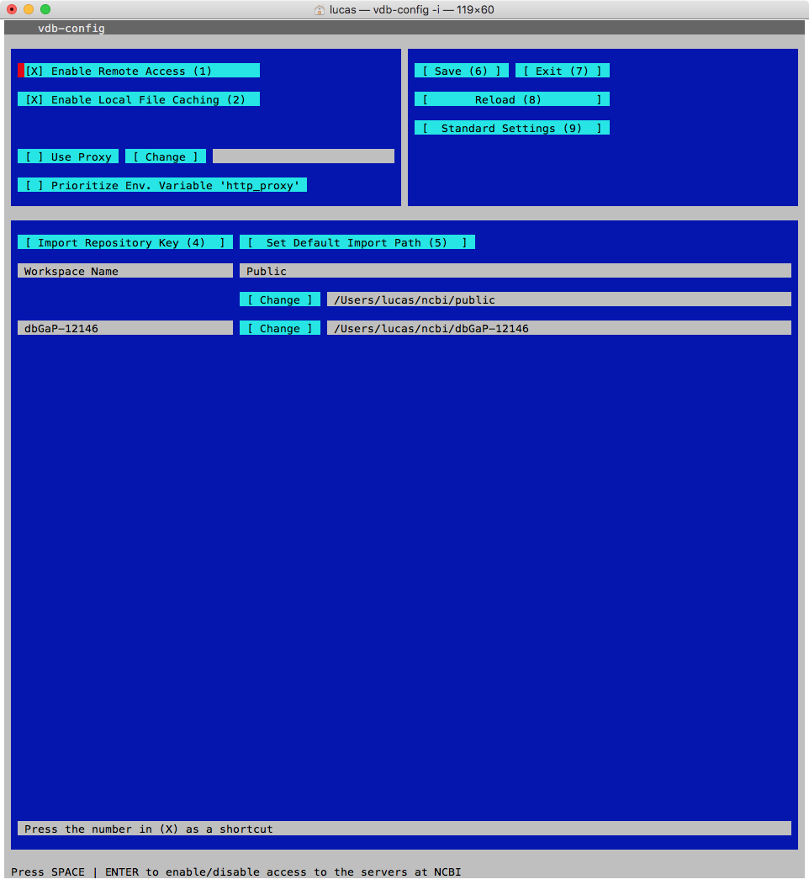

# Aspera Browser Plugin

In theory, the Aspera software used to download files from dbGaP is purported to be cross platform and available with multiple users in mind. In practice it was not found to be the case and files from dbGaP can only be downloaded using the Aspera Connect browser plugin with the Firefox browser. So, download and install Firefox (https://www.mozilla.org/en-US/firefox/desktop/) and then Aspera Connect (http://downloads.asperasoft.com/downloads). With these installed you can proceed to the download steps using the Firefox browser.

# Download from dbGaP

Sign into dbGaP using your eRA Commons account, which was created for you by a PI. From the dbGaP website (https://www.ncbi.nlm.nih.gov/gap) navigate to the link titled _Controlled Access Data_ and click _Log In_ at the top right. There are two sets of tabs now, for the first select _Authorized Access_ and for the second select _Downloads_. From the table of projects, select the _Download_ link at the far right for the project of interest.
Now open the Aspera Connect application (it is a browser plugin as well as an application) and then return to Firefox. You should be at the _Download_ page and a number of options should be showing, click the _new directory_ option and bar will pop up at the top of the browser window. Click allow and then click _new_ directory again, storing the file wherever you like. You have now downloaded your files from dbGaP.

# Obtaining the dbGaP repository key

Send the following instructions to the PI of the project and ask them to send you the `*.ngc` file, as you will need it for decryption.


_dbGaP repository key is a dbGaP project wide security token required for configuring NCBI SRA toolkit and decryption tools. The key is provided in a file with suffix ".ngc". It can be obtained from two places in PI’s dbGaP account._

_1) The first place is the project page under "My Projects" tab, through a link named "get dbGaP repository key" in the "Actions" column. The key downloaded from here is valid to all downloaded data under the project as well as the project password is not changed since the download._

_2) The second place is the download page under "Downloads" tab, through a link named "get dbGaP repository key in the "Actions" column. The key downloaded from here is download package specific._

_The dbGaP repository key is only available from the dbGaP account of primary PI of approved data access request. It is not available from downloader’s dbGaP account. Downloaders should get the key directly from the PI._

# Decrypt using NCBI SRA Toolkit

Go to the NCBI SRA Toolkit website (https://trace.ncbi.nlm.nih.gov/Traces/sra/sra.cgi?view=software) and download the appropriate SRA Toolkit for your architecture. Once downloaded, unzip and untar the file and either add the contents of the bin directory to your PATH or run commands using the long paths. For example:

```{bash, eval=FALSE}
PATH=$PATH:/usr/local/sratoolkit.2.8.0-mac64/bin/
vdb-config -i
----------------------OR--------------------------
./sratoolkit.2.8.0-mac64/bin/vdb-config -i
```

If unfamiliar with how to run shell commands, find someone who can help. The above shell commands are appropriate for macOS, but other systems might work slightly different. Instructions here are intentionally vague, as at least some knowledge of shell commands will be need for many of the following steps.

So, having downloaded, unzipped, untarred, and run the above commands, a terminal GUI application should be showing.



The repository key that was previously obtained from the PI should be imported by navigating with the arrow and tab keys to the `*.ngc file`. There will be a dialog concerning changing the location of directories, answer no. Exit the interface, saving changes.

From terminal, navigate to the project directory as was shown in the configuration interface. Then issue the `vdb-decrypt` command specifying the top level directory of the encrypted files as the source and optionally specify a destination, otherwise the files are just decrypted in place. Here are the commands:

```{bash, eval=FALSE}
cd ~/ncbi/dbGaP-12146/
~/Downloads/sratoolkit.2.8.0-mac64/bin/vdb-decrypt ~/Documents/52964/
```

B-I-N-G-O, now your files are decrypted and ready for use!
